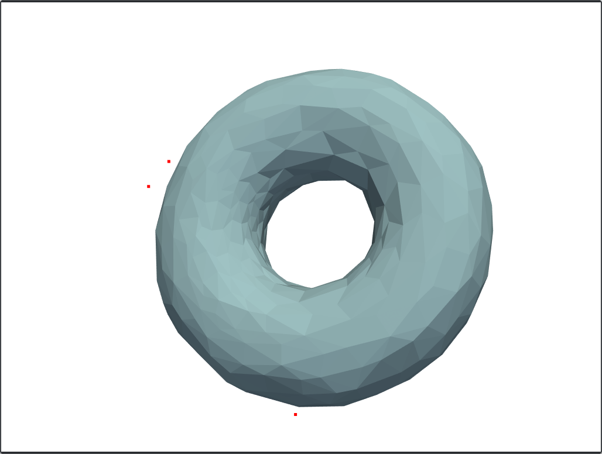
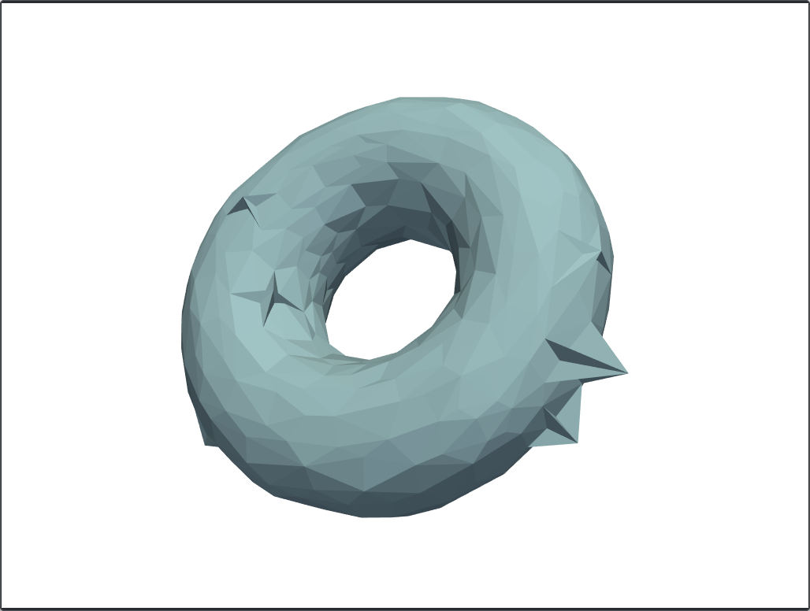
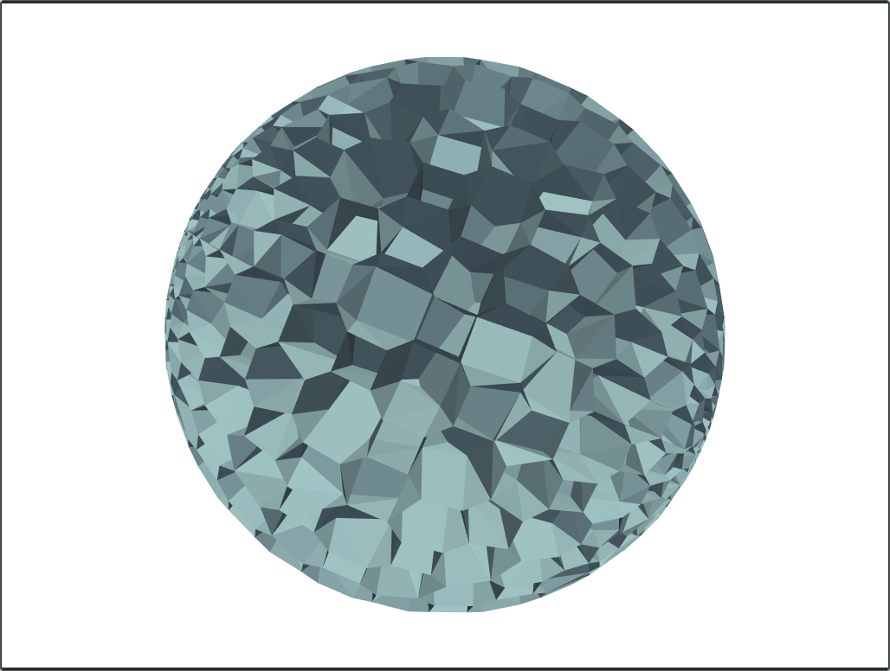
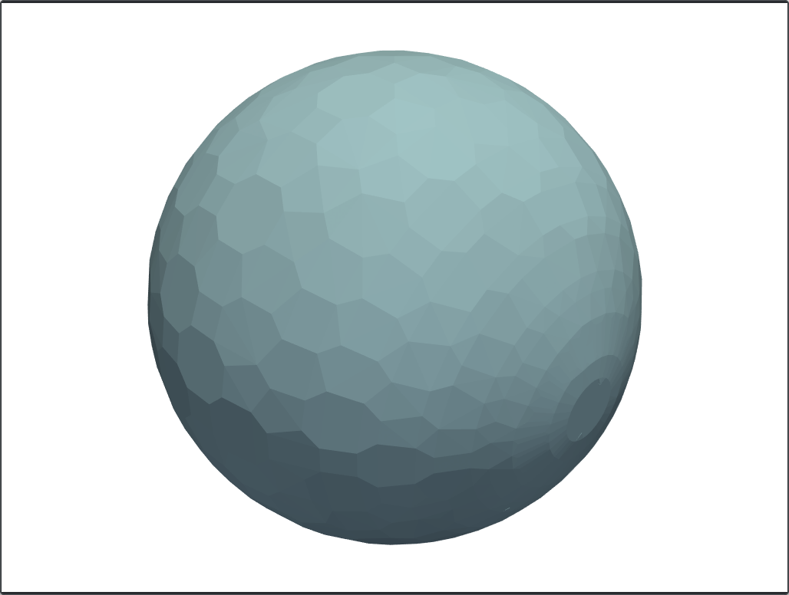
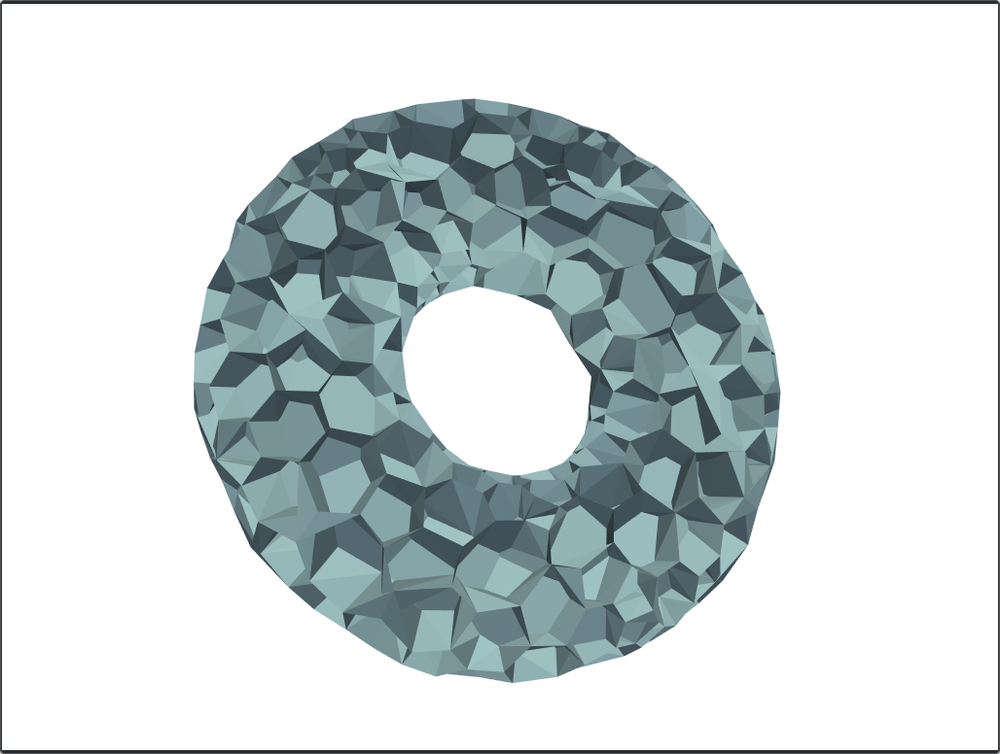
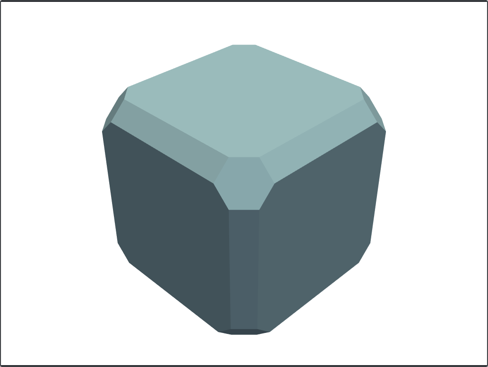

# VoroMesher
This is the first demo of a project on generating 3D Voronoi diagrams. 


This script generates a 3D Voronoi Diagram from a tetrahedral mesh. It can only receive VTK files.

## Usage
Just clone the repo and install the requirements. 
```
git clone https://github.com/asouris/voronoi-mesher.git
cd voronoi-mesher
pip install -r requirements.txt
```

To run an example:
```
python VoroMesher.py examples/cube.vtk
```

And some flag are:
Flag | Description
:---:|:----------:
`-h` | Shows a help message
`-o` | Shows original mesh 
`-s` | Supresses points outside of the Convex Hull
`-p` | In case `-s` was defined, shows those points
`-ne`| Shows Voronoi mesh without external faces

## More screenshots

|   | 
|:---:|:---:|
| Torus suppressing and showing outside points  | Torus

|   | 
|:---:|:---:|
| Sphere without external faces  | Sphere

|   | 
|:---:|:---:|
| Torus without external faces  | Cube


<style>
    table {
        width: 100%;
    }
</style>